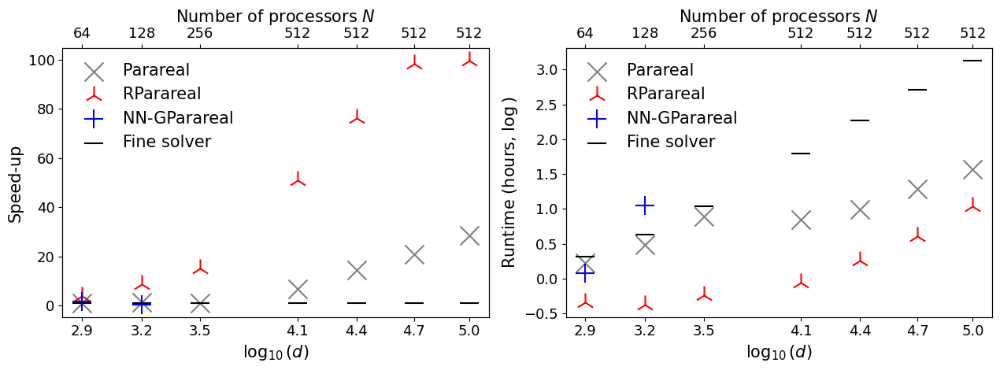
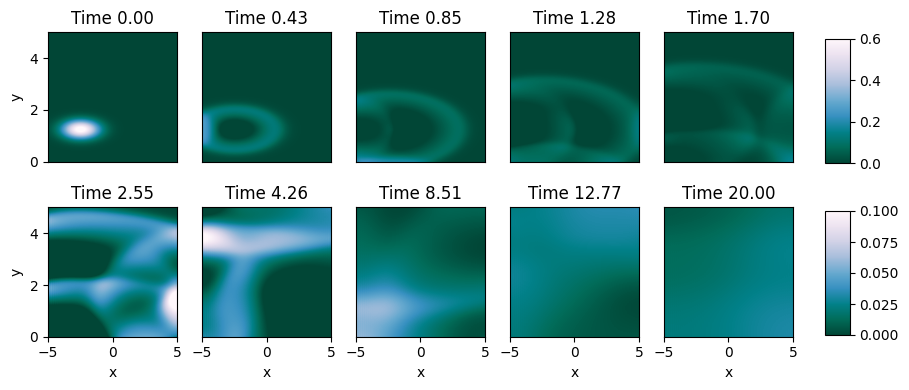

# Accelerating Parareal with Random Weights Neural Networks

This repository is the official implementation of [Accelerating Parareal with Random Weights Neural Networks](). 

>This work introduces a novel method to accelerate a well-known parallel-in-time (PinT) technique, Parareal, using random weights neural networks. Beyond theoretical guarantees as universal approximators, these models are lightweight and quick to train, allowing the PinT solution of partial differential equations on a spatial mesh of 105 points with minimal overhead. We demonstrate their effectiveness on systems of real-world significance, such as the 2D Diffusion-Reaction equation, and the Shallow Water Equation, achieving speed gains ranging from x1.3 to x5 compared to Parareal.
<p align="center">

  
  <p align="center"> Speed-up (left) and runtime (right) analysis for the Diffusion-Reaction Equation. Bottom x-axis, number of discretizations for the spatial mesh (log). Top x.axis, total number of machine cores used for parallelization. Three parallel-in-time algorithms are compared, namely Parareal, NN-GParareal, and our proposal, RParareal. Note the sensibly faster speed-up achieved by RParareal across the spectrum.</p>
</p>

## Requirements

The code was run using python 3.10. To install requirements:

```setup
pip install -r requirements.txt
```


## Results

Together with Viscous Burgers' equation, and the Diffusion-Reaction equation, we solve the Shallow Water equations. Derived from the compressible Navier-Stokes equations, the SWEs are a system of hyperbolic PDEs exhibiting several behaviors of real-world significance that are known to challenge emulators, such as sharp shock formation dynamics, sensitive dependence on initial conditions, diverse boundary conditions, and spatial heterogeneity. Example applications include the simulation of tsunamis or general flooding events.


Numerical solution of the shallow water equation over $(x,y) \in [-5,5]\times[0,5]$ with $N_x=264$ and $N_y=133$ for a range of system times $t$. Only the water depth $h$ (blue) is plotted.

The following table portrays the speed-up achieved by RParareal. Note that NN-GParareal failed to converge in all the trials.
<div align="center">

| **$d$**  | **$K_P$** | **$K_R$** | **$T_F$** | **$T_P$** | **$T_R$** | **$S_P$** | **$S_R$**      |
|----------|-------|-------|---------|---------|---------|-------|----------------|
| 15453 | 52    | 14    | 22h 54m | 5h 8m   | 1h 25m  | 4.47  | $\textbf{16.24}$ |
| 31104 | 50    | 13    | 3d 2h   | 15h 43m | 4h 9m   | 4.68  | $\textbf{17.77}$ |
| 60903 | 14    | 9     | 13d 15h | 19h 30m | 12h 34m | 16.74 | $\textbf{25.97}$ |
| 105336 | 8     | 6     | 38d 4h  | 1d 7h   | 23h 30m | 29.35 | $\textbf{38.98}$ |

</div>

We provide the code and outputs to fully replicate the tables and figures in the paper. We have used the following naming convention to organize the files:
- `PDE_name/`: folder containing simulation outputs. Note that for bigger PDEs the final solution $\boldsymbol{u}$ can be several hundred megabytes. In that case, we have removed it. We left a trace of this post-processing in the corresponding script.
- `PDE_name.bash`: bash script to run the simulations on the cluster. It requires MPI and SLURM. Nevertheless, the actual Python code can be easily adapted to run sequentially on any hardware.
- `PDE_name.py`': Python script to carry out the simulations. If you wish to run this sequentially, because you do not have easy access to MPI, remove the `mpi4py` import at the top, and remove the `pool=pool, parall='mpi'` arguments of the `run` method. Warning: expect out-of-memory issues and long (or very long) runtimes for bigger systems.
- `PDE_name_analysis.py`: Python script to replicate the results reported on the paper.

Execute the bash scripts as `bash Burgers.bash 128`, where 128 is the number of cores you wish to use; see the bash script for more information. For the Diffusion-Reaction equation, only the $N=512$ case is provided, by calling `bash ReactDiff.bash 512`. For the others, the values of `dx` need to be updates inside the bash script.

`Burgers_sequential.ipynb` provides an example of how to simulate Burgers' equation with 128 space discretizations that can run on any hardware. 


## Acknowledgments

Simulations for the shallow water equation have been carried out using code from the [PararealML](https://github.com/ViktorC/PararealML) GitHub repository with minor modifications. The cloned and edited code is located in `pararealml/`. My own code is shared using the same permissive licence.
